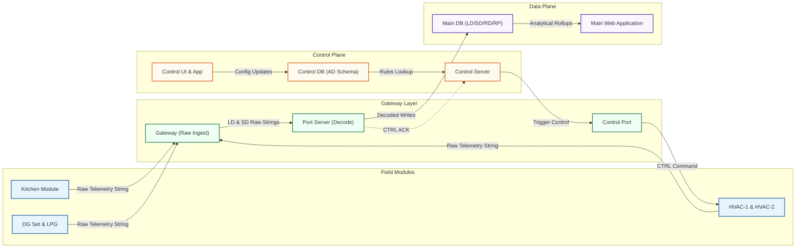

# ProTech Architecture: End-to-End Telemetry Dataflow & IoT Parsing Draft

This draft provides a comprehensive breakdown of the core telemetry processing and control feedback mechanisms operating in the **ProTech Data Platform**. It details the component architecture from physical fields to analytical reporting schemas, and documents the binary/hexadecimal IoT payload parsing specifications.

---

## 1. High-Level Telemetry Architecture

The ProTech platform splits data operations into four isolated layers to process massive telemetry streams while supporting bi-directional, near-real-time controls:



---

## 2. In-Depth Component Breakdown

### 2.1 The Field Modules (Edge Sources)
The physical edge layers consist of isolated telemetry modules deployed across food malls, stores, and operational centers:
*   **Kitchen Module:** Captures utility usage, refrigeration temperatures, and power profiles.
*   **HVAC-1 & HVAC-2 (Heating, Ventilation, & Air Conditioning):** Generates active heating/cooling metrics and supports bi-directional control loops for environmental balancing.
*   **DG Set (Diesel Generator):** Transmits operational status, run hours, fuel levels, and load profiles.
*   **LPG System (Liquefied Petroleum Gas):** Sends gas flow rate, pressure, and remaining volume telemetry.
*   **Other Sensors:** General ambient temperature, relative humidity, water flow, and visual occupancy indicators.

All modules transmit telemetry packets as highly compressed **raw ASCII-hex strings** to eliminate edge payload overhead and survive low-bandwidth environments.

### 2.2 The Gateway Layer (Ingestion & Decoupling)
This layer acts as the high-availability ingestion buffer and protocol translator:
1.  **Gateway (Receives Raw):** Listens on dedicated TCP/UDP ports to capture raw ASCII-hex telemetry packets from the field. It immediately responds with ingestion acknowledgments (`ACK`) to confirm packet delivery at the edge.
2.  **Port Server (Decode & Ingest):** The central processing unit of the gateway layer. It acts as a multi-threaded parser that:
    *   Ingests raw strings (`LD_string` for real-time live data, `SD_string` for structured stored data).
    *   Validates packet checksums to ensure zero transmission corruption.
    *   Parses ASCII headers (IDs, timestamps, statuses) and decodes hexadecimal floats.
    *   Performs database inserts across target schemas in the Data Plane.
    *   Emits command acknowledgments (`CTRL_ACK`) to the Control Plane upon executing field-level overrides.
3.  **Control Port (Commands):** A dedicated, low-latency communication socket that pushes downstream operational directives (`CTRL_command`) to bi-directional devices (such as HVAC-1).

### 2.3 The Control Plane (Governance & Automation)
The Control Plane governs system configurations and automates device behaviors:
*   **Control DB (AD Schema):** Houses master datasets in Unity Catalog:
    *   *Control Tables:* Operational thresholds, device boundaries, and execution schedules.
    *   *Alert Tables:* Active alarm states, breach histories, and notification configurations.
    *   *Master Tables:* Physical site masters, customer billing records, and active utility mappings.
*   **Control Application (Config Utilities):** A web-based configuration utility for system administrators to modify operational variables, update device schedules, and monitor active alerts.
*   **Control Server:** A rules-based microservice that evaluates real-time sensor metrics against the Master control tables. When a threshold is breached or a schedule triggers, it executes a *control rules lookup*, retrieves the matching action, and dispatches a low-latency trigger command to the Gateway's **Control Port**.

### 2.4 The Data Plane (Storage & Serving)
The Data Plane manages persistent telemetry storage and analytical aggregations:
*   **AD Replica (Main DB):** A read-replica of the Control Plane's AD Schema (site master, configuration data) to enable lightning-fast queries without overloading the core transactional Control DB.
*   **LD Schema (Live Data):**
    *   `LD Table`: Stores decoded real-time parameters (current, voltage, power factors) for active monitoring.
    *   `LR Table`: Houses the unaltered, historical raw logs (`LR`) as they were received by the Port Server to serve as a digital forensic audit trail.
*   **SD Schema (Stored Data):**
    *   `SD Tables`: Stores hourly, daily, and monthly aggregated sensor metrics (such as cumulative energy consumption in kWh).
*   **RD Schema (Running Directives / Commands):**
    *   `BC Table`: Logs all broadcast directives (`BC`) and command histories pushed to the field.
*   **RP Schema (Reporting & Processing):**
    *   `RP Tables`: Houses pre-computed analytical rollups, metrics, and KPI matrices.
*   **Main Application:** The client-facing portal that queries the Data Plane's `RP Tables` to render premium analytical reports, energy efficiency scorecards, and historical utilization charts.

---

## 3. IoT Telemetry Payload Specifications

When field modules transmit telemetry to the Gateway, they bundle information into an optimized, fixed-width ASCII-hex string. Based on the logic defined in `IoT_Payload_Visualizer.html`, here is the exact parsing structure of a sample **$00618200DMcDonalds120170000230002000105/03/202610:59:1600000000468F1C854E856F7446964AE93F6DA54C000000000000000000000000000000004226599D41DB6E9141892489436E947843725E2A4377409A09645*** payload:

### 3.1 Metadata & ASCII Header Segment
The first part of the payload contains human-readable ASCII data denoting source, device type, and temporal coordinates:

| Segment | Raw Content | Purpose | DB Column Map | Decoded Output | Notes |
|---|---|---|---|---|---|
| **Start Frame** | `$` | Delimiter | N/A | `$` | Standard start indicator. |
| **Protocol Header** | `00618200D` | Packet Metadata | N/A | Protocol Version / Length | Denotes packet formatting structure. |
| **Gateway ID** | `McDonalds1` | Location Identification | `LocationName` | `"Ozarde FoodMall"` | Resolved via AD Master Site Mapping. |
| **Comm ID** | `2017000023` | Device Identifier | `CommunicationId` | `"2017000023"` | Unique physical hardware ID. |
| **Meter Type** | `0002` | Utility Classification | `MeterType` | `"Electricity"` | `0002` resolves to Electricity. |
| **Meter Serial** | `0001` | Logical Unit ID | `MeterSerial` | `"0001"` | Logical serial address of device. |
| **Txn Date** | `05/03/2026` | Logical Event Date | `TxnDate` | `2026-03-05` | Formatted as DD/MM/YYYY. |
| **Txn Time** | `10:59:16` | Logical Event Time | `TxnTime` | `10:59:16` | Formatted as HH:MM:SS. |

### 3.2 Hexadecimal Telemetry Segment (IEEE 754 Float32)
The next block contains 15 consecutive 8-character hexadecimal blocks representing physical measurements encoded as **single-precision IEEE 754 floats**.

> [!TIP]
> **Floating-Point Conversion Math.** To decode these blocks, convert the 8-character hex string to a binary 32-bit sequence, extract the sign bit (1 bit), exponent (8 bits), and mantissa (23 bits), and evaluate:
> $$\text{Value} = (-1)^{\text{sign}} \times (1 + \text{mantissa}) \times 2^{(\text{exponent} - 127)}$$
> Finally, multiply by the matching **AD Master Multiplier** to get physical metrics.

| Block | Hex Payload | Target Metric | DB Column | Raw Float Decoded | Multiplier | Mapped Physical Reading |
|---|---|---|---|---|---|---|
| **Block 1** | `00000000` | Reserved | N/A | `0.0` | 1.0 | `0.0` (Reserved Channel) |
| **Block 2** | `468F1C85` | Apparent Power | `ReadingRw` | `18318.26` | 1.0 | **$18,318.26 \text{ kVA}$** |
| **Block 3** | `4E856F74` | Cumulative Energy | `Line3` | `1119336960.0` | 0.001 | **$1,119,336.96 \text{ kWh}$** |
| **Block 4** | `46964AE9` | Active Power | `Line4` | `19237.477` | 0.001 | **$19.237 \text{ kW}$** |
| **Block 5** | `3F6DA54C` | Power Factor | `Line5` | `0.928` | 1.0 | **$0.928 \text{ (PF)}$** |
| **Block 6** | `00000000` | Unused | N/A | `0.0` | 1.0 | `0.0` (Empty/Unused) |
| **Block 7** | `00000000` | Unused | N/A | `0.0` | 1.0 | `0.0` (Empty/Unused) |
| **Block 8** | `00000000` | Unused | N/A | `0.0` | 1.0 | `0.0` (Empty/Unused) |
| **Block 9** | `00000000` | Unused | N/A | `0.0` | 1.0 | `0.0` (Empty/Unused) |
| **Block 10**| `4226599D` | Phase R Current | `Line10` | `41.5875` | 1.0 | **$41.59 \text{ Amps}$** |
| **Block 11**| `41DB6E91` | Phase Y Current | `Line11` | `27.429` | 1.0 | **$27.43 \text{ Amps}$** |
| **Block 12**| `41892489` | Phase B Current | `Line12` | `17.1428` | 1.0 | **$17.14 \text{ Amps}$** |
| **Block 13**| `436E9478` | Phase R Voltage | `Line13` | `238.58` | 1.0 | **$238.58 \text{ Volts}$** |
| **Block 14**| `43725E2A` | Phase Y Voltage | `Line14` | `242.369` | 1.0 | **$242.37 \text{ Volts}$** |
| **Block 15**| `4377409A` | Phase B Voltage | `Line15` | `247.252` | 1.0 | **$247.25 \text{ Volts}$** |

### 3.3 Checksum & Footer Segment
The final part of the payload ensures the mathematical validity of the packet before database writes:
*   **Checksum (`09645`):** A custom 5-digit CRC checksum computed by the Field Module on the entire string. The Port Server calculates its own checksum on the incoming packet and compares it. If they mismatch, the packet is rejected and flagged as corrupted.
*   **End Frame (`*`):** Delimiter indicating the packet is complete.

---

## 4. End-to-End Ingestion Step Walkthrough

```
[Field Module] -----> Generates Hex Telemetry String
                      |
                      v
[Gateway TCP Socket]  Recapture, validate start ($) & end (*) delimiters
                      |
                      v
[Port Server] ------> 1. Extract Header & map Location ID (McDonalds1) to Ozarde FoodMall
                      2. Split 15 Hex Telemetry Blocks
                      3. Perform IEEE 754 conversions & apply multiplier factors
                      4. Store raw payload in LD Schema (LR Table) for historical audits
                      5. Insert decoded records into LD Schema (LD Table) & SD Schema (SD Tables)
                      |
                      v
[Data Plane (DB)] --> 1. RP aggregation rules trigger, performing hourly rollups
                      2. RP Tables updated (Analytical Store)
                      |
                      v
[Main Web App] -----> Queries RP Tables, showing real-time current, voltage, and energy curves
```
