# ProTech Data Platform: End-to-End Architectural Process Draft

This document provides a highly detailed architectural overview and complete process draft for the **PROTECH Data Platform**. It details the phase-wise cloud migration strategy, outlines the design of the config-driven **Silver Layer Databricks Framework**, maps out the 7-phase data pipeline lifecycle, and provides concrete dataset ingestion configurations.

---

## 1. Architectural Evolution: Phase-Wise Ingestion

The ProTech data platform undergoes a systematic three-phase evolution to transition legacy on-premise operational schemas to a modern, fully cloud-native, Python- and React-based real-time analytics environment.

```mermaid
graph TD
    classDef sourceClass fill:#d4e1f5,stroke:#4a90e2,stroke-width:2px;
    classDef processClass fill:#fefefe,stroke:#333,stroke-width:1.5px,stroke-dasharray: 5 5;
    classDef targetClass fill:#e1f5fe,stroke:#0288d1,stroke-width:2px;
    
    subgraph Phase 1: Migration & Initial Analytics
        P1_Src["On-Prem SQL Server<br>(AD & SD Schemas)"]:::sourceClass -->|ADF Pipelines| P1_Land["ADLS Landing Zone<br>(Parquet Files)"]:::targetClass
        P1_Land -->|Databricks Framework| P1_Silver["Delta Silver Layer<br>(Curated & Cleaned)"]:::targetClass
        P1_Silver -->|PowerBI / Reporting| P1_Dash["Dashboards"]:::processClass
    end
    
    subgraph Phase 2: Hybrid Cloud Architecture
        P2_CloudSQL["Cloud SQL Server<br>(Sourced Stored Data - SD)"]:::sourceClass -->|ADF Pipelines| P2_Land["ADLS Landing Zone<br>(Parquet Files)"]:::targetClass
        P2_OnPrem["On-Prem SQL Server<br>(Live Value - LV)"]:::sourceClass -->|Direct Queries| P2_OnPrem
        P2_Land -->|Databricks Framework| P2_Silver["Delta Silver Layer"]:::targetClass
    end
    
    subgraph Phase 3: Full Cloud-Native & Tech Migration
        P3_Python["Python Script Engine<br>(Stored Data - SD)"]:::sourceClass -->|Direct Write| P3_Land["ADLS Landing Zone<br>(Parquet Files)"]:::targetClass
        P3_Live["Live Value Data (LV)"]:::sourceClass -->|Event Hubs / Parquet| P3_Land
        P3_Land -->|Databricks Framework| P3_Silver["Delta Silver Layer"]:::targetClass
        P3_Silver -->|Python API Backend| P3_React["React Frontend App"]:::processClass
    end
```



### 1.1 Phase 1 – Initial Data Migration & Analytics Setup
*   **Objective:** Connect Azure Data Factory (ADF) to the on-premise SQL Server, perform historical migration of critical schemas, and enable curated reporting via a Silver Lakehouse layer.
*   **Data Scope:**
    *   One full year of **SD (Stored Data)** sensor and utility metering datasets.
    *   All necessary **AD (Admin)** master metadata and configuration structures.
*   **Ingestion Pipeline:** 
    *   ADF pipelines are established to orchestrate direct connectivity to on-prem SQL Server via Self-Hosted Integration Runtimes (SHIR).
    *   Data is pulled directly into **Azure Data Lake Storage (ADLS)** and saved in **Parquet format** inside the landing layer:
        `storage-container-data-landing/mcdonalds/mcdonalds_sd/` and `storage-container-data-landing/mcdonalds/mcdonalds_ad/`.
    *   Schemas are preserved as received from the source. No cloud SQL database is introduced in this phase.
*   **Analytics Setup:** Databricks processes the raw Parquet datasets into the **Silver Layer** (Unity Catalog Delta tables). All business dashboards and analytical engines consume purely from this curated Silver layer, avoiding raw landing files.

### 1.2 Phase 2 – Hybrid Architecture with Cloud SQL Server
*   **Objective:** Migrate legacy stored operational data to the cloud to reduce on-premise resource consumption, while maintaining live transaction pathways locally.
*   **Planned Changes:**
    *   The on-premise SQL Server is migrated to an **Azure SQL Database (Cloud SQL)**, which becomes the active system of record for **SD (Stored Data)**.
    *   ADF pipelines are refactored to pull the SD datasets from the new Cloud SQL Server instead of on-prem.
    *   The downstream landing layer structures, Databricks Silver processing, and analytical layers remain completely unchanged, preserving pipeline integrity.
*   **LV Data Handling:** **LV (Live Value)** transaction records continue to reside on the physical on-premise SQL Server. They are not migrated to the Cloud SQL environment in this phase.

### 1.3 Phase 3 – Full Cloud-Native and Technology Migration
*   **Objective:** Achieve a database-free operational backend and eliminate traditional relational SQL Server dependencies. Re-architect the application layer to use lightweight, scalable React and Python components.
*   **Planned Changes:**
    *   **SQL Elimination:** Cloud SQL Server is decommissioned. SD data is generated natively using lightweight, optimized **Python script engines**.
    *   **Direct Ingestion:** Python scripts generate SD datasets and write them directly into the ADLS Landing layer in **Parquet format**, completely bypassing Azure Data Factory for SD ingestion.
    *   **Live Value Ingest:** LV (Live Value) streaming is established using **Azure Event Hubs** or converted directly into real-time Parquet feeds streaming into the Landing zone.
    *   **Technology Transitions:**
        *   Database Store procedures (**PL/SQL**) are refactored into **Python modules**.
        *   Legacy API microservices (**C# / .NET Framework**) are ported to modern asynchronous **Python Web Frameworks**.
        *   The frontend portal is rewritten using **React.js** to deliver a responsive, state-of-the-art user interface.

---

## 2. ProTech Silver Layer Framework

Ingestion from the Landing layer to the Silver layer is controlled by a highly optimized, config-driven ingestion engine (`protech-databricks-framework` / `udap`). The core design pattern dictates: **No new Python code, no new recipe classes, and no new glue scripts are required to onboard a new dataset.** 

### 2.1 The Two-File Ingestion Specification
To onboard any dataset, developers only define two static JSON files:
1.  **`schema.json` (Column Manifest):** Defines the structural footprint, reader configuration, and table target.
    *   *Path:* `{config_root}/{data_source}/datasets/{data_set}.json`
2.  **`rules.json` (Phase Executions):** Specifies which processing, validation, and data quality (DQ) checks execute.
    *   *Path:* `{config_root}/{data_source}/rules/{rules_file}`

> [!IMPORTANT]
> **Explicit-Only Execution.** Nothing runs in the pipeline unless it is explicitly declared in `rules.json`. This makes the execution path completely deterministic, highly auditable, and easy to debug.

### 2.2 Data Pipeline Lifecycle (The 7-Phase Ingestion Engine)
The framework maps every run through a strictly sequenced lifecycle orchestrated by `udap.recipes.base.IngestionRecipe`:

| Phase | Purpose | Typical Rules & Functions |
|---|---|---|
| **1. `before_extract`** | Pre-read validations and file operations. | PGP decryption (`decrypt_files`), control-file reconciliation (`ctl_reconciliation`), path pattern checks (`file_pattern`). |
| **2. `extract`** | **Recipe-Internal.** Reads landing raw files into a string-typed Spark DataFrame using the specified options. | (Automatically resolved by file format; no user-defined rules) |
| **3. `after_extract`** | High-performance structural and schema integrity validation. | Mandatory column checks (`mandatory`), string length constraints (`string_length`), primary key integrity (`primary_key`), uniqueness checks (`unique`), enum checks (`enum`). |
| **4. `before_transformation`**| Cast raw string columns to strongly-typed data types and apply enrichments. | Type-casting (`type_cast`), type-cast validation (`cast_failure`), column renaming (`rename`), case-shifting (`case`), column masking (`mask`), timezone alignment (`convert_timezone`). |
| **5. `after_transformation`** | Business logic, range checks, and analytical drift detection. | Bounds checks (`range`), regex matching (`regex`), SQL expressions (`expression`), join lookups (`lookup`), statistical drift checks (`distinct_count_drift`, `sum_drift`). |
| **6. `before_load`** | Last gate before committing transactional writes. | Ordering checks (`ordering_check`), system watermarks (`watermark`). |
| **7. `load`** | Commit records into Silver Delta target. | Exactly one CDC operation: `append`, `overwrite`, `merge`, `scd2` (SCD Type 2), or `delete`. |
| **8. `after_load`** | Post-write analysis, auditing, and maintenance. | Integrity audits (`post_write_count_check`), Delta index optimization (`optimize` with Z-Order partitioning). |

---

## 3. High-Performance Engine Optimizations

The framework is architected to ingest TB-scale data efficiently over Spark:

### 3.1 Single-Pass Batched Rule Engine
Instead of executing sequential filter passes for each DQ rule, the `RuleEngine` analyzes the current phase's declared rules and **fuses consecutive batchable rules into a single Spark execution pass**.
*   **Criteria for Batching:** A rule is batchable if it implements the `emit_err_expr()` method and has the breach strategy set to `on_breach="quarantine"`.
*   **Supported Rules:** `mandatory`, `enum`, `regex`, `range`, `date_bounds`, and `expression`.
*   **Optimization Mechanism:**
    ```python
    # Under the hood, the engine compiles multiple rules into a unified SELECT statement:
    df = staged.withColumn("_err_msg", F.concat_ws(", ", *err_columns))
    df = df.withColumn("_failed_rules_arr", F.array_compact(F.array(*fired_columns)))
    good_df, error_df = partition_by_err_msg_batch(df)
    ```
    This reduces the disk-read/shuffle footprint to **exactly one Filter + Union operation per phase**, preventing severe Spark bottlenecking.

### 3.2 Strict Idempotency & Retry Safety
Ingestion runs are fully protected against partial write failures, enabling safe retries at any moment:
*   Each orchestration attempt is stamped with a unique `run_uuid` (UUID4).
*   During extraction, individual records are assigned an internal hash-derived `uuid`.
*   Ingestion sinks leverage an `idempotency_key` (defaulting to `["_run_id", "_uuid"]`) to perform an anti-join against the destination Silver table. If a crash occurs mid-write, a subsequent retry will bypass already-written rows automatically.
*   The Postgres audit database uses `ON CONFLICT DO NOTHING` SQL patterns, preventing duplicate audit records on repeated executions.

### 3.3 Breach Strategies & Error Handling
Developers can tailor how the engine reacts to data quality breaches via `on_breach` flags:
1.  **`quarantine` (Default):** Bad rows are separated and written to the dedicated quarantine table (e.g. `silver_quarantine.mcdonalds.mcdonalds_sd`). The primary pipeline completes successfully with the clean rows.
2.  **`fail`:** The pipeline aborts immediately, rolling back transaction boundaries, notifying operators, and returning an exit code of `1`.
3.  **`warn`:** Logs the DQ failure as a warning and proceeds to load the records into the primary Silver table.

---

## 4. Current Ingestion Mappings

The ProTech metadata catalog currently hosts configurations for two key datasets:

```carousel
```json
// Dataset Configuration: mcdonalds_sd
{
  "version": "1.0",
  "dataset": {
    "source": "mcdonalds",
    "name": "mcdonalds_sd",
    "description": "McDonalds sensor / utility metering data"
  },
  "input": {
    "format": "parquet",
    "path_template": "landing/{source}/{name}/{run_date}/",
    "file_pattern": "*.parquet"
  },
  "output": {
    "catalog": "silver",
    "schema": "mcdonalds",
    "table": "mcdonalds_sd",
    "error_table": "silver_quarantine.mcdonalds.mcdonalds_sd"
  },
  "columns": [
    { "source": "AutoId", "type": "string", "nullable": false, "primary_key": true },
    { "source": "SiteName", "type": "string", "nullable": false },
    { "source": "UtilityId", "type": "integer", "nullable": false },
    { "source": "TxnDate", "type": "date", "nullable": false },
    { "source": "TxnTime", "type": "string", "nullable": false },
    { "source": "ReadingCv", "type": "double" },
    { "source": "Consumption", "type": "double" }
  ],
  "rules_file": "mcdonalds_sd_rules.json"
}
```
<!-- slide -->
```json
// Ingestion Rules: mcdonalds_sd_rules
{
  "version": "1.0",
  "dataset_ref": "mcdonalds.mcdonalds_sd",
  "ingestion": { "mode": "strict", "error_threshold_pct": 0 },
  "phases": {
    "after_extract": [
      { "name": "mandatory_check", "type": "mandatory", "on_breach": "quarantine" },
      { "name": "string_length_check", "type": "string_length", "on_breach": "quarantine" },
      { "name": "primary_key_check", "type": "primary_key", "on_duplicate": "quarantine_all" }
    ],
    "before_transformation": [
      { "name": "derive_year", "type": "expression_column", "target": "Year", "expr": "year(TxnDate)" },
      { "name": "derive_month", "type": "expression_column", "target": "Month", "expr": "month(TxnDate)" }
    ],
    "load": [
      { "name": "silver_append", "type": "append" }
    ],
    "after_load": [
      { "name": "post_count_match", "type": "post_write_count_check", "tolerance": 0, "on_breach": "warn" }
    ]
  }
}
```
<!-- slide -->
```json
// Dataset Configuration: weather_report_days
{
  "version": "1.0",
  "dataset": {
    "source": "weather_data",
    "name": "weather_report_days",
    "description": "Daily weather metrics per location"
  },
  "input": {
    "format": "csv",
    "path_template": "landing/{source}/{name}/{run_date}/{run_id}/",
    "file_pattern": "*_IN_days_*.csv",
    "options": {
      "header": true,
      "delimiter": ",",
      "quote": "\"",
      "escape": "\\",
      "encoding": "UTF-8"
    }
  },
  "output": {
    "catalog": "silver",
    "schema": "weather_data",
    "table": "weather_report_days",
    "error_table": "silver_quarantine.weather_data.weather_report_days"
  },
  "columns": [
    { "source": "name", "type": "string", "nullable": false },
    { "source": "datetime", "type": "date", "nullable": false, "format": "yyyy-MM-dd" },
    { "source": "tempmax", "type": "double" },
    { "source": "tempmin", "type": "double" },
    { "source": "temp", "type": "double" },
    { "source": "humidity", "type": "double" },
    { "source": "uvindex", "type": "integer" }
  ],
  "rules_file": "weather_report_days_rules.json"
}
```
<!-- slide -->
```json
// Ingestion Rules: weather_report_days_rules
{
  "version": "1.0",
  "dataset_ref": "weather_data.weather_report_days",
  "ingestion": { "mode": "strict", "error_threshold_pct": 0 },
  "phases": {
    "after_extract": [
      { "name": "mandatory_check", "type": "mandatory", "on_breach": "quarantine" },
      { "name": "string_length_check", "type": "string_length", "on_breach": "quarantine" }
    ],
    "before_transformation": [
      { "name": "type_cast", "type": "type_cast", "default_date_format": "yyyy-MM-dd" },
      { "name": "cast_failure_check", "type": "cast_failure", "on_breach": "quarantine" }
    ],
    "after_transformation": [
      {
        "name": "range_check",
        "type": "range",
        "columns": [
          { "column": "humidity", "min": 0, "max": 100 },
          { "column": "precipprob", "min": 0, "max": 100 },
          { "column": "uvindex", "min": 0, "max": 15 }
        ],
        "on_breach": "quarantine"
      }
    ],
    "load": [
      { "name": "silver_append", "type": "append" }
    ],
    "after_load": [
      { "name": "post_count_match", "type": "post_write_count_check", "tolerance": 0, "on_breach": "warn" }
    ]
  }
}
```
```

---

## 5. Architectural Alignment Questions

To finalize this process draft and prepare for Phase 2 or Phase 3 implementation steps, let's align on the following design choices:

> [!NOTE]
> **1. Phase Migration Status:** Which migration phase is currently being executed in the environment? Are you actively implementing the Phase 2 Hybrid Cloud SQL structure, or is the focus transitioning to the Phase 3 fully cloud-native Python & Event Hub framework?
>
> **2. Real-Time Streaming Architecture for LV:** In Phase 3, what is the preferred Event Hubs ingestion mechanism to Spark Delta? Will we utilize Spark Structured Streaming directly consuming from Event Hubs connection strings, or will we write temporary Landing files in ADLS to process in micro-batches?
>
> **3. Data Quality Rules:** Are there any additional specific business logic checks (such as cross-column relationships, custom SQL lookups, or statistical drift thresholds) that must be added to the McDonald's sensor data pipeline rules?
